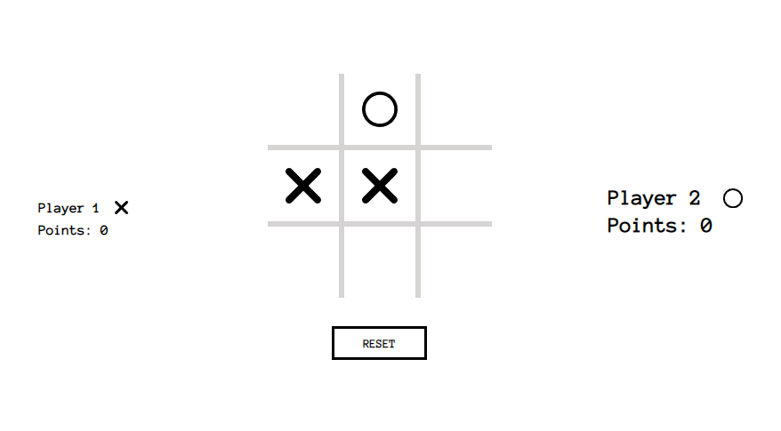

# Tic Tac Toe

This is a Tic tac toe game in vanilla Javascript. The objective of this project
is to build a tic tac toe game to have as little global code as possible using 
Facotry functions and the module pattern. Give it a try 
<a href="https://kenua.github.io/tic-tac-toe/" target="_blank">here</a>.